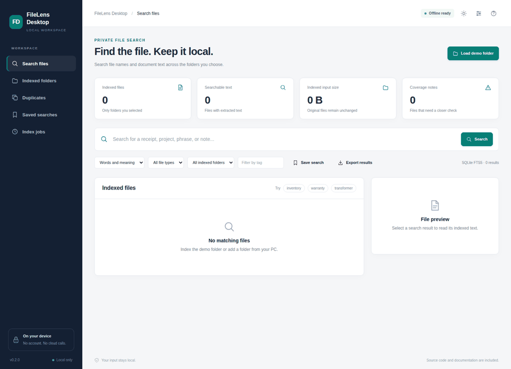
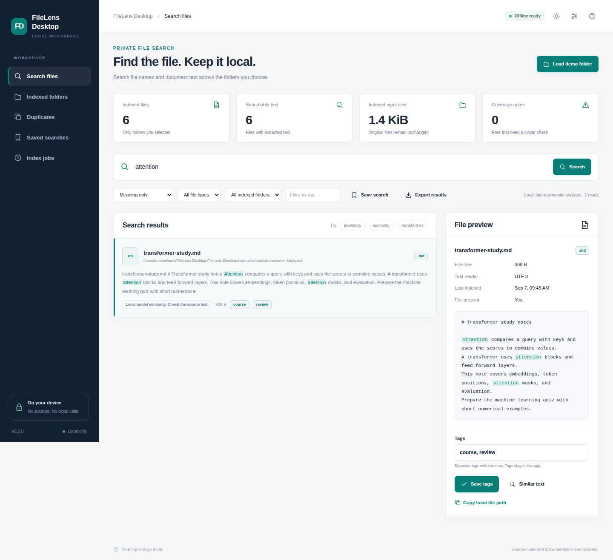
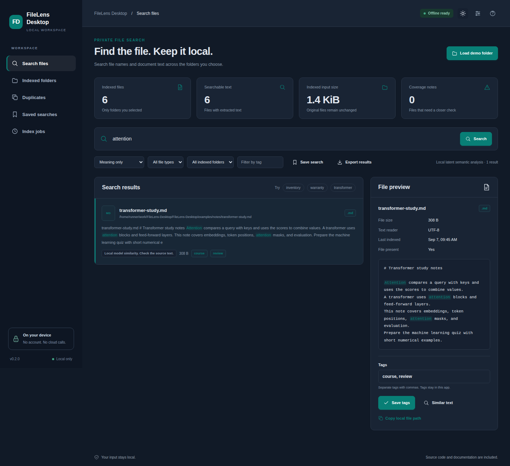

# FileLens Desktop

Search local files by name, text, tags, and meaning.

[](https://github.com/danial-maqbool/FileLens-Desktop/actions/workflows/tests.yml)




I made FileLens to search selected folders without uploading documents anywhere. It builds a local index, reads supported files, and keeps the searchable data in an encrypted local vault.

## Main features

- Keyword and local semantic search
- OCR for images and scanned PDFs
- Search filters for folders, file types, and tags
- Duplicate file detection with SHA-256
- Saved searches and reusable tags
- Incremental rescans for selected folders
- Encrypted local index and backups

## Quick start

```bash
git clone https://github.com/danial-maqbool/FileLens-Desktop.git
cd FileLens-Desktop
```

**Windows**

```powershell
py -3 bootstrap.py
.\start.bat --demo
```

**Linux / macOS**

```bash
python3 bootstrap.py
sh start.sh --demo
```

For normal use, start without `--demo`. OCR needs Tesseract installed on the computer.

## Screenshots

<p align="center">
  
  
</p>

## Project layout

```text
app/        indexing and search logic
web/        local interface
localdesk/  local runtime, vault, OCR and jobs
examples/   sample files
tests/      automated tests
scripts/    verification tools
docs/       setup, design and test notes
```

## Notes

The built-in semantic search learns only from the indexed files. OCR can misread text, so search results from scans should be checked against the source when accuracy matters.

More details: [Setup](docs/SETUP.md) · [User guide](docs/USER_GUIDE.md) · [Architecture](docs/ARCHITECTURE.md) · [Testing](docs/VERIFICATION.md) · [Security](SECURITY.md)

## License

MIT. See [LICENSE](LICENSE).
